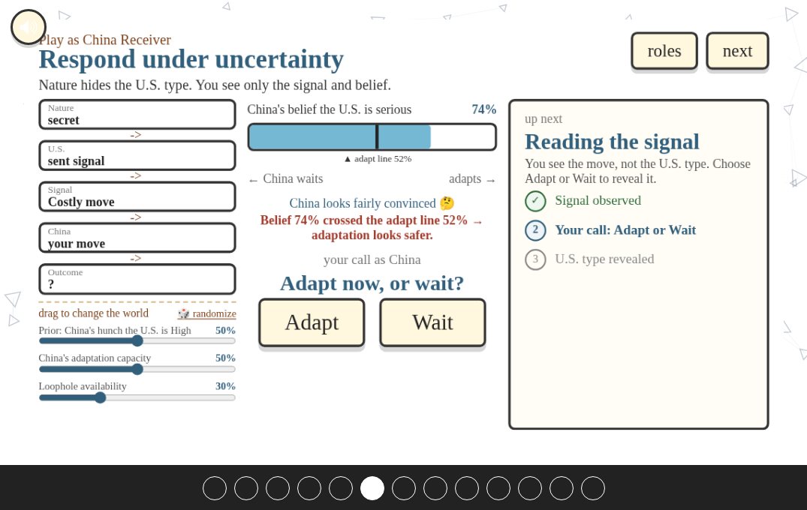

# Signals of Compute Power

An interactive explorable explanation about how compute policy works as a costly signal between great powers, and what that means for a middle power like Vietnam.



You play through a U.S. to China to Vietnam signaling model: the U.S. sends a costly compute signal, China reads it and updates its beliefs, then adapts or waits, and Vietnam inherits the downstream pressure while trying to keep room to move.

Built in the spirit of Nicky Case's ["The Evolution of Trust"](https://ncase.me/trust/): hand drawn, playful, and meant to be poked at rather than read like a paper.

## Play it

Live: https://melanieyes.github.io/signaling-vietnam-game/

## What it teaches

The game turns a costly-signaling model into something you can play with:

- **U.S. (sender)** chooses a signal: export controls, a training-compute threshold, or provider oversight. Each costs something different.
- **China (receiver)** cannot see U.S. resolve directly. It reads the signal, updates a belief, and adapts once that belief crosses an adaptation threshold.
- **Vietnam (downstream)** never picks the signal or the response. It inherits the shock and chooses how much room to preserve.

The model draws on Fearon on why costly signals can be credible, and Quek on the different ways those costs work (sunk, tied hands, installment, reducible). It is a toy model for building intuition, not a forecast.

## Run it locally

This is **vanilla JavaScript with no build step, no framework, and no package manager**. You only need a static file server, because the slides load `words.html` and the model spec over `fetch()` (which fails on `file://`).

```bash
git clone https://github.com/melanieyes/signaling-vietnam-game.git
cd signaling-vietnam-game
python3 -m http.server 8731
```

Then open http://localhost:8731. Pick a fresh port if 8731 is busy.

There is nothing to compile: edit a file and reload the browser. The only check in use is a syntax pass:

```bash
node --check js/sims/SignalingScenario.js
```

## Project layout

```
index.html        loads everything in order (libs, core, sims, slides, main)
words.html        text copy for the text slides, keyed by id
css/              slides.css (engine) and signaling-scenarios.css (the game scenes)
js/lib/           helpers.js (the pub/sub engine) and sound.js
js/core/          reusable components: Slideshow, Button, TextBox, Background, ...
js/sims/          the model and scenes: Signaling, SignalingWorld, SignalingScenario
js/slides/        one file per section, each pushing its slides onto the SLIDES array
signals_of_compute_power_copilot_spec_v2.json   source of truth for the model
```

Scripts load in a strict order and everything is global, so a new file needs its `<script>` tag placed in the right band of `index.html`.

## Credits

Created by Melanie ([github](https://github.com/melanieyes)).

Interface, sound, and explorable style adapted from Nicky Case's ["The Evolution of Trust"](https://ncase.me/trust/). The signaling model builds on the costly-signaling frameworks of [Fearon (1997)](https://www.jstor.org/stable/174551) and [Quek (2021)](https://doi.org/10.1017/S0003055420001094).
